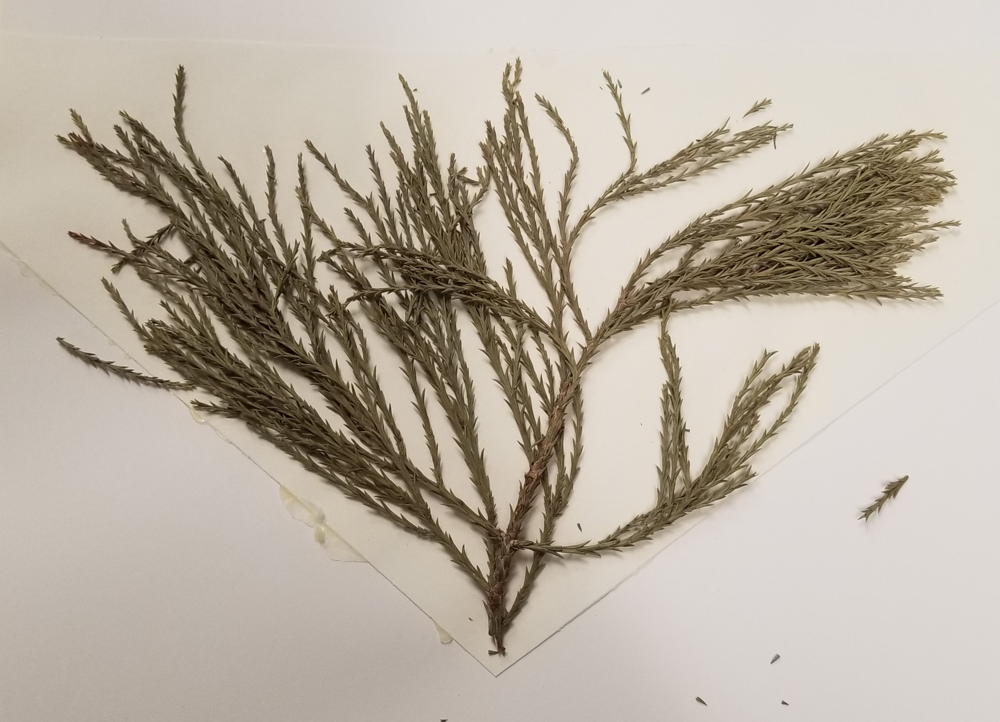

```{r setup, include=FALSE}
knitr::opts_chunk$set(echo = TRUE)
```

## Sequence Data

This [sequence data](https://github.com/rosatiem98/rosatiem98.github.io/blob/b683b09421b8428a629ebf75f9f32f0e1ba99ac7/plant_ITS%20(1).fasta) is a collection of DNA sequence of the entire ITS gene region in Angiosperm and Gymnosperm samples pulled from online databases. This set of [data](https://github.com/rosatiem98/rosatiem98.github.io/blob/c03555493c164c0240d596f179b77a41cbd2ff07/Research%20Sequences.docx) is a collection of DNA sequences gathered through DNA extraction and amplification of the ITS gene region in herbarium specimens. 

The analysis preformed will be done with a small DNA data set with 19 samples from the extraction DNA and samples from the online database DNA. In total a dataset of 399 sequences is analyzed.




The purpose of this analysis is to determine the evolutionary differences between angiosperm and gymnosperm specimens. From analyzing differences, a phylogenetic tree is built around the ITS gene region of these two groups. 

___
```{r echo=FALSE, message=FALSE, warning=FALSE}
library(tidyverse)
library(seqinr)
library(Biostrings)
library(msa)
library(phangorn)
library(ShortRead)
library(ape)
library(ggplot2)
library(ggtree)
library(ggmsa)
library(zoom)
```
___

## Read in dataset from small research dataset FASTA file 

```{r message=FALSE, warning=FALSE}
myspecies <- readDNAStringSet("./Interested Species ITS 2.fasta")
```


```{r echo=FALSE, message=FALSE, warning=FALSE, include=FALSE}
duplicated(myspecies)
```

```{r echo=FALSE, message=FALSE,warning=FALSE}
un <- unique(myspecies)

align399 <- readRDS("./finalproject/subset_msa_align.RDS")
```

## Example Alignment of sequences #196:206

```{r message=FALSE, warning=FALSE}
shortggmsa <- ggmsa(myspecies[196:206], start=100, end = 150)
shortggmsa
```


___

## Alignment of research sequences

unspecies <- msa(un)
```{r message=FALSE, warning=FALSE}
align399 <- readRDS("./finalproject/subset_msa_align.RDS")
msa399 <- as.phyDat(align399,type="DNA")

```
___

## Conduct model test

mt399 <- modelTest(msa399)
```{r message=FALSE, warning=FALSE}
mt399 <- readRDS("./modeltest_399.RDs")

dist399 <- dist.ml(msa399, model="JC69")

msa399_UPGMA <- upgma(dist399)

parsimony(msa399_UPGMA,msa399)

msa399_NJ <- NJ(dist399)

parsimony(msa399_NJ,msa399)
msa399_optim <- optim.parsimony(msa399_UPGMA,msa399)

msa399_optim <- readRDS("./msa399_optim")
```
___


msa399_pratchet <- pratchet(msa399)

```{r message=FALSE, warning=FALSE}
msa399_pratchet <- readRDS("./msa399_pranchet")

fit399 <- pml(msa399_UPGMA,msa399)
```

___


fit399JC <- optim.pml(fit399, model="JC", rearrangement = "stochastic")

```{r message=FALSE, warning=FALSE}
fit399JC <- readRDS("./fit399JC.RDS")
```
logLik(fit399JC)

___

## Build a phylogenetic tree with bootsttrap values

___

bs399 <- bootstrap.pml(fit399JC,bs=100, optNni=TRUE, multicore=TRUE, control = pml.control(trace=0))

```{r echo=FALSE, message=FALSE, warning=FALSE}
bs399 <- readRDS("./boot_strp_research_seqs399.RDS")
```
___

## Initial tree

```{r echo=FALSE, message=FALSE, warning=FALSE,}
tre <- plotBS(midpoint(fit399JC$tree), bs399, p=50, type="p")
```

## Let's clean the names of the tips

___

## Cleaning the Tip labels


```{r message=FALSE, warning=FALSE}

genus195 <- tre$tip.label[1:195] %>% str_split(" ") %>% map_chr(2)
species195 <- tre$tip.label[1:195] %>% str_split(" ") %>% map_chr(3)
names195 <- paste0(genus195," ",species195)


genus197 <- tre$tip.label[197] %>% str_split(" ") %>% map_chr(2)
species197 <- tre$tip.label[197] %>% str_split(" ") %>% map_chr(3)
names197 <- paste0(genus197," ",species197)

genus315 <- tre$tip.label[199:315] %>% str_split(" ") %>% map_chr(2)
species315 <- tre$tip.label[199:315] %>% str_split(" ") %>% map_chr(3)
names315 <- paste0(genus315," ",species315)

genus321 <- tre$tip.label[320:321] %>% str_split(" ") %>% map_chr(2)
species321 <- tre$tip.label[320:321] %>% str_split(" ") %>% map_chr(3)
names321 <- paste0(genus321," ",species321)

genus324 <- tre$tip.label[323:324] %>% str_split(" ") %>% map_chr(2)
species324 <- tre$tip.label[323:324] %>% str_split(" ") %>% map_chr(3)
names324 <- paste0(genus324," ",species324)

genus328 <- tre$tip.label[328] %>% str_split("") %>% map_chr(1)
species328 <- tre$tip.label[328] %>% str_split("Â") %>% map_chr(2)
names328 <- paste0(genus328," ",species328)


genus330 <- tre$tip.label[330] %>% str_split(" ") %>% map_chr(2)
species330 <- tre$tip.label[330] %>% str_split(" ") %>% map_chr(3)
names330 <- paste0(genus330," ",species330)

genus396 <- tre$tip.label[336:396] %>% str_split(" ") %>% map_chr(2)
species396 <- tre$tip.label[336:396] %>% str_split(" ") %>% map_chr(3)
names396 <- paste0(genus396," ",species396)

genus399 <- tre$tip.label[399] %>% str_split(" ") %>% map_chr(2)
species399 <- tre$tip.label[399] %>% str_split(" ") %>% map_chr(3)
names399 <- paste0(genus399," ",species399)

tre$tip.label[1:195] <- names195
tre$tip.label[197] <- names197
tre$tip.label[199:315] <- names315
tre$tip.label[320:321] <- names321
tre$tip.label[323:324] <- names324
tre$tip.label[328] <- names328
tre$tip.label[330] <- names330
tre$tip.label[336:396] <- names396
tre$tip.label[399] <- names399

```
___

## Exploring Phylogenetic trees
```{r message= FALSE, warning=FALSE}

circle_tree <- ggtree(tre, branch.length = "none", layout ="circular") + theme_tree2()
circle_tree
ggsave(filename = "circle_tree.png")
square_tree <- ggtree(tre) + geom_tree() + theme_tree2()
ggsave(filename = "square_tree.png")  
```


## Subsetting tree 

```{r message=FALSE, warning=FALSE}
tree50 <- rtree(50)

ggtree(tree50) + theme_tree2() + geom_tiplab2()


#Creating 5 separate random trees using rtree function


data(tre)
layout(matrix(1:4, 2,2))
for (i in 1:5) plot(rtree(20))

```

## Observations and conclusions

Based on the trees that were generated one observation that can be made is in the large circular tree the species are grouped into large clades. This may be indicative of gymnosperm and angiosperm species grouping together based on the ITS gene region. Another possibility is because of the repeated species samples collected. When plotting a basic rectangular tree there are some species that have pronounced branches. 

When plotting 5 random trees using "tre" tree the nodes on the tree are observed to shift. This may be due to the samples plotted are similar or are the same species with slightly different ITS gene sequence.

This project's purpose was to gather full ITS gene sequences from angiosperm and gymnosperm species and build a phylogeny with the aligned sequences. This was accomplished on a foundational level. In the future the relationships within the trees observed will be further analyzed through further phylogenetic analysis and tree manipulation. 


